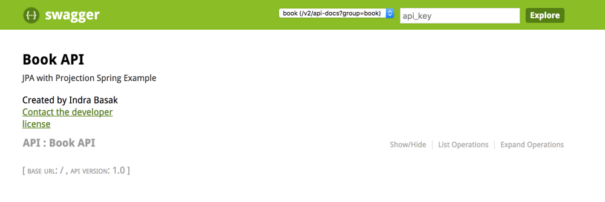

[![Build Status][travis-badge]][travis-badge-url]


JPA Projection with Spring Example
=========================================
This is a [**Spring Boot**](https://projects.spring.io/spring-boot/) based microservice example backed by
[HSQLDB](http://hsqldb.org/) database. This examples shows the following:
* Use `spring.datasource` properties and Spring Data auto configuration.
* How to use JPA's `CrudRepository`
* How to insert `UUID` field in HSQLDB database and generate `UUID `index.
* How to use JPA projection.

### Build
Execute the following command from the parent directory:
```
mvn clean install
```

### Start the Service
The main entry point `jpa-postgres-spring` example is `com.basaki.example.postgres.boot.BookApplication` class.
You can start the application from an IDE by starting the `BookApplication` class.
```

 /\\ / ___'_ __ _ _(_)_ __  __ _ \ \ \ \
( ( )\___ | '_ | '_| | '_ \/ _` | \ \ \ \
 \\/  ___)| |_)| | | | | || (_| |  ) ) ) )
  '  |____| .__|_| |_|_| |_\__, | / / / /
 =========|_|==============|___/=/_/_/_/
 :: Spring Boot ::        (v1.5.7.RELEASE)

2017-09-22 11:44:34.926  INFO 6403 --- [           main] c.b.e.jpa.spring.boot.BookApplication    : Starting BookApplication on ibasa-mb-34436.local with PID 6403 (/Users/indra.basak/Development/examples/tmp/jpa-projection-spring/target/classes started by indra.basak in /Users/indra.basak/Development/examples/tmp/jpa-projection-spring)
2017-09-22 11:44:34.930  INFO 6403 --- [           main] c.b.e.jpa.spring.boot.BookApplication    : No active profile set, falling back to default profiles: default
2017-09-22 11:44:34.993  INFO 6403 --- [           main] ationConfigEmbeddedWebApplicationContext : Refreshing org.springframework.boot.context.embedded.AnnotationConfigEmbeddedWebApplicationContext@3c130745: startup date [Fri Sep 22 11:44:34 PDT 2017]; root of context hierarchy

...

2017-09-22 11:44:39.353  INFO 6403 --- [           main] .d.s.w.r.o.CachingOperationNameGenerator : Generating unique operation named: readUsingGET_1
2017-09-22 11:44:39.455  INFO 6403 --- [           main] s.b.c.e.t.TomcatEmbeddedServletContainer : Tomcat started on port(s): 8080 (http)
2017-09-22 11:44:39.461  INFO 6403 --- [           main] c.b.e.jpa.spring.boot.BookApplication    : Started BookApplication in 4.846 seconds (JVM running for 5.508)

```
### Accessing Swagger 
On your browser, navigate to `http://localhost:8080/` to view the Swagger. 


Click the `Show/Hide` link to view all the operations exposed by Book API.


[travis-badge]: https://travis-ci.org/indrabasak/jpa-projection-spring.svg?branch=master
[travis-badge-url]: https://travis-ci.org/indrabasak/jpa-projection-spring/